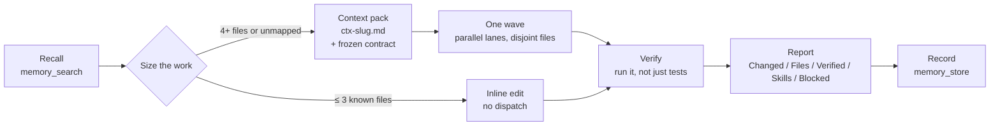

<div align="center">

<picture>
  <source media="(prefers-color-scheme: dark)" srcset="https://raw.githubusercontent.com/chadixearth/graphyloop/main/assets/logo-dark.svg">
  
</picture>

[](https://github.com/chadixearth/graphyloop)
[](https://www.npmjs.com/package/graphyloop)
[](https://github.com/chadixearth/graphyloop/actions/workflows/ci.yml)
[](LICENSE)

# GraphyLoop

</div>

GraphyLoop is a one-command agentic workflow kit for AI coding agents: it wires Claude Code, OpenCode, Codex, Cursor, Gemini CLI, Oh My Pi and DeepSeek Harness with a 25-agent squad, parallel wave planning, persistent memory and an MCP server. Zero dependencies.

[Landing page](https://chadixearth.github.io/graphyloop/) · [npm](https://www.npmjs.com/package/graphyloop) · [Harness guide](docs/harnesses.md) · [Reference](docs/reference.md) · [llms.txt](llms.txt)

## Quick Start

```bash
npx graphyloop        # a bare command installs — it wires every harness it detects
# restart your harness, open a real project, then ask your agent:
/chadi-init
```

Requires Node.js ≥ 20. On a fresh machine with no harness yet, GraphyLoop wires all seven so you are ready whichever one you open first. Target specific ones with `--harness claude,omp`. Nothing is written into your workspace — everything lives in your home config (`~/.graphyloop/` plus each harness's own directory).

### Supported harnesses

| Harness | `--harness` | Detected when | How GraphyLoop wires it | Start the workflow |
|---|---|---|---|---|
| **OpenCode** | `opencode` | `~/.config/opencode/` | plugin (`graphyloop_*` tools) + 26 agents + 15 `/chadi-*` commands + AGENTS.md | `/chadi-init` |
| **Claude Code** | `claude` | `~/.claude/` or `~/.claude.json` | MCP server + 26 agents + 15 commands + AGENTS.md | `/chadi-init` |
| **Codex** | `codex` | `~/.codex/` | MCP server + 15 prompts + AGENTS.md | `/prompts:chadi-init` |
| **Cursor / Windsurf** | `cursor` | `~/.cursor/` | MCP server + AGENTS.md rule | ask: "run the graphyloop workflow init" |
| **DeepSeek Harness** | `dsh` | `~/.dsh/` or `$DSH_HOME` | MCP server + 26 role prompts + `graphyloop-squad` skill + AGENTS.md | load the `graphyloop-squad` skill |
| **Oh My Pi** | `omp` | `~/.omp/` | MCP server in `~/.omp/agent/mcp.json` + 26 squad agents + skills; AGENTS.md only if you have none | ask: "run the graphyloop workflow init" |
| **Gemini CLI** | `gemini` | `~/.gemini/` | MCP server in `~/.gemini/settings.json` + `/chadi-*` TOML commands + bundled skills in `~/.gemini/skills/`; GEMINI.md only if you have none | `/chadi-init` |

Per-harness file locations, verification and dsh notes: [docs/harnesses.md](docs/harnesses.md).

### Setup with any AI assistant (copy-paste)

Paste the block below into your AI harness — it installs, verifies (`GRAPH_LOOP_DOCTOR_OK`), and reports on its own. Raw copy: [`docs/SETUP-PROMPT.md`](docs/SETUP-PROMPT.md).

```
You are setting up GraphyLoop (github.com/chadixearth/graphyloop, npm package `graphyloop`) — a one-command agentic workflow kit for AI coding agents: a 25-agent squad, parallel wave planning, persistent memory, a harness-neutral workflow and an MCP server that works in any harness. Zero dependencies.

Goal: install it for THIS machine's harness(es), verify the install actually works, and report. Do NOT edit any config file by hand — run only the installer. Do NOT run npm publish, npm login, or anything unrelated.

Steps:
1. Prerequisites:
   - Run `node --version` — must be 20 or newer. If older, tell the user to install Node.js 20+ and stop there.
   - Detect which harnesses exist on this machine (check for any of): ~/.config/opencode/  (OpenCode), ~/.claude.json or ~/.claude/  (Claude Code), ~/.codex/  (Codex), ~/.cursor/  (Cursor / Windsurf), ~/.dsh/ or $DSH_HOME  (DeepSeek Harness / `dsh`), ~/.omp/  (Oh My Pi / `omp`), ~/.gemini/  (Gemini CLI). On Windows, ~ = %USERPROFILE%.
2. Install:
   - Run:  npx --yes graphyloop
     (a bare `graphyloop` is the install command: it wires every detected harness, or all 7 on a fresh machine.)
   - To target specific harnesses:  npx --yes graphyloop --harness claude,omp   (names: opencode, claude, codex, cursor, dsh, omp, gemini)
   - If npx asks "Ok to proceed?", answer yes. If npx is missing, stop and tell the user to install Node.js 20+ (npx ships with npm).
3. Verify — every applicable check must pass:
   - `npx --yes graphyloop doctor` prints one row per harness (present / wired) and its LAST line must be GRAPH_LOOP_DOCTOR_OK. If it prints GRAPH_LOOP_DOCTOR_ISSUES <n>, run the `fix:` command it shows for each unwired row, then run doctor again.
   - Core engine files exist: ~/.graphyloop/graphyloop/cli.mjs , ~/.graphyloop/mcp-server.mjs , ~/.graphyloop/lib/mcp.mjs , ~/.graphyloop/lib/engine.mjs .
   - OpenCode (if present): ~/.config/opencode/opencode.json contains plugin entries "./plugins/graphyloop/plugin.js" and "./plugins/server-guard/plugin.js", and ~/.config/opencode/agents/ contains 26 .md files.
   - Claude Code (if present): ~/.claude.json has an mcpServers.graphyloop entry, and ~/.claude/agents/ is populated.
   - Codex (if present): ~/.codex/config.toml contains a [mcp_servers.graphyloop] section.
   - Cursor (if present): ~/.cursor/mcp.json has a "graphyloop" entry.
   - DeepSeek Harness (if present): ~/.dsh/cordis.patch.yml contains a row `id: graphyloop-mcp` naming '@deepseek-ai/dsh-mcp-client', ~/.dsh/AGENTS.md exists, and ~/.dsh/skills/ holds graphyloop-squad. Optional deeper check: `dsh --profile headless --dump-config` prints that row. In dsh the tools are namespaced — call them as mcp__graphyloop__<name> (e.g. mcp__graphyloop__swarm_state).
   - Oh My Pi (if present): ~/.omp/agent/mcp.json has mcpServers.graphyloop, and ~/.omp/agent/agents/ holds the squad .md files. An existing ~/.omp/agent/AGENTS.md is intentionally kept — the workflow then loads from the bundled skill graphyloop-workflow.
   - Gemini CLI (if present): ~/.gemini/settings.json has mcpServers.graphyloop, ~/.gemini/commands/chadi-init.toml exists, and ~/.gemini/skills/graphyloop-workflow/ exists. An existing ~/.gemini/GEMINI.md is intentionally kept.
   - If any check fails: re-run the install with --force (automatic backups) and re-verify. Still failing? Report the exact error and stop.
4. Wrap up: tell the user to RESTART their harness (close/reopen the terminal or editor), open a real project (not their home directory), and start the workflow: ask for /chadi-init (OpenCode, Claude Code, Gemini CLI), /prompts:chadi-init (Codex), or "run the graphyloop workflow init" (Oh My Pi, Cursor, Windsurf). In the DeepSeek Harness there are no slash commands: ask the agent to load the `graphyloop-squad` skill instead. Give a one-line summary of what was installed.

Do not ask permission for reversible steps — proceed. Stop only for: Node < 20, an install failure, or a prompt you cannot answer.
```

## How the workflow works

**Workflow v2** is harness-neutral: the same rules run in OpenCode, Claude Code, Codex, Cursor, Windsurf, DeepSeek Harness, Oh My Pi and Gemini CLI.



1. **Recall first, record last** — `memory_search` before planning, `memory_store` after.
2. **Size the work** — ≤ 3 known files is an inline edit; 4+ files or unmapped code is a build.
3. **Context pack before dispatch** — one batched read pass writes `ctx-<slug>.md` (path:line, current code, pattern to copy) so lanes start editing instead of rediscovering.
4. **Freeze the contract** — `contract-<slug>.md` is the only cross-lane dependency.
5. **One wave** — all independent lanes in one parallel dispatch, one lane per layer (data / backend / frontend / tests / UI), strictly disjoint file ownership, max 4 concurrent by default.
6. **Turn economy** — lanes batch reads, make the first edit by turn 5 and finish by about turn 25.
7. **No polling** — servers, builds and deploys run in the background; never a sleep loop.
8. **Verify by running** — smoke the changed path; tests alone are not proof; UI in a real browser; artifacts by viewing the rendered file.
9. **Audit wave only when needed** — reviewer/security for auth, data, tenant, payment, or a diff you cannot read end to end.
10. **Artifact wave** for posters, decks, PDFs and video — freeze `brief-<slug>.md`, hero piece first, one lane per artifact.
11. **Evidence-first report** — Changed / Files / Verified (verbatim output) / Skills / Blocked.

The `plan_feature` MCP tool does steps 3–5 for you: it returns the wave plan, writes the contract and context pack, and ends every builder lane brief with the turn-economy footer (the wave-0 lane that writes the contract and the integration/verify/deploy lanes get two shorter variants).

## Features

| Capability | Description |
|---|---|
| 🐝 **Swarm orchestration** | Spawn, distribute, and track agents with a hierarchical swarm topology — zero API keys, state in `<project>/.graphyloop/state.json` |
| 🧠 **Persistent memory** | Store decisions, patterns, lessons, and events; keyword-search across sessions. Survives restarts and compactions |
| 🤖 **25-agent squad** | Specialized agents for exploration, backend, frontend, testing, security, review, refactoring, docs, data, performance, and more (26 agent files including the driver; see [The squad](#the-squad-25-agents)) |
| 🌊 **Wave planner** | One call turns "I want an inventory system" into context pack + contract → **database ∥ backend ∥ frontend ∥ tests** → integration → **test ∥ typecheck ∥ security ∥ performance ∥ review** → gated deploy, with file ownership and dependencies the engine enforces |
| 🔌 **Universal MCP bridge** | The same 15 graphyloop tools work in all 7 harnesses — any MCP-capable harness |
| 📋 **15 slash commands** | `chadi-init` · `chadi-fast` · `chadi-review` · `chadi-plan` · `chadi-waves` · `chadi-db` · `chadi-deploy` · `chadi-audit` · `chadi-release` · `chadi-research` · `chadi-confusing` · `chadi-discuss` · `chadi-go` · `chadi-recall` · `chadi-skills` |
| 🔑 **Supabase + Vercel credentials** | Store keys once per project (chmod 600, git-ignored before the first write), sync them into the env file the framework reads, and preflight database/deploy work. Values are never returned to the model |
| 📚 **70 bundled skills** | Contract-first waves, API hardening, frontend security, accessibility, web performance, dependency audit, Supabase, Vercel, secrets, memory, the workflow itself, plus a curated library of design, research, GSAP and three.js packs. A skill you already have is never overwritten ([details](docs/reference.md#configuration)) |
| 🔒 **Config safety** | Timestamped backups before every write, never overwrites your config keys, idempotent re-runs, uninstall removes only byte-identical copies |
| 🪟 **Windows hang guard** | `npm run dev` inside an agent session no longer freezes the turn: server-guard starts the server without inheriting the tool's stdout pipe, so the call returns in milliseconds while the server keeps serving |
| ⚡ **Zero dependencies** | Pure Node (≥ 20), no npm packages at runtime, no shell scripts — installs the same on every platform. MIT licensed |

### Harness alone vs + GraphyLoop

| Capability | Harness alone | + GraphyLoop |
|---|---|---|
| Agent collaboration | Isolated sessions | Swarm with shared memory |
| Orchestration | Manual | Workflow v2: context pack, frozen contract, one parallel wave, 25-agent squad |
| Memory | Session-only | Persistent, searchable, survives restarts |
| Multi-harness | One tool, one rules file | Same workflow in 7 harnesses |
| Delivery discipline | Ad hoc | Verify-by-running and evidence-first reports |
| Setup | Hand-written rules per tool | `npx graphyloop` |
| Safety | — | Backup-first config merges, content-matched uninstall |

## FAQ

### What is GraphyLoop?
GraphyLoop is a one-command agentic workflow kit for AI coding agents. It installs a 25-agent squad, parallel wave planning, persistent memory and an MCP server into the harnesses you already use. It is open source (MIT) with zero runtime dependencies.

### Does GraphyLoop work with Claude Code, Cursor and Gemini CLI?
Yes. For Claude Code it registers an MCP server in `~/.claude.json`, installs 26 agent files and 15 `/chadi-*` slash commands, and adds the workflow rules. For Cursor and Windsurf it adds the MCP server to `~/.cursor/mcp.json` and the rules to `~/.cursor/rules/`. For Gemini CLI (since 0.5.0) it adds the MCP server to `~/.gemini/settings.json` and installs the commands as TOML files in `~/.gemini/commands/`; an existing `GEMINI.md` is never overwritten.

### Which other harnesses are supported?
Seven in total: OpenCode, Claude Code, Codex, Cursor, DeepSeek Harness (`dsh`), Oh My Pi (`omp`) and Gemini CLI. Anything else that speaks MCP can use the same server via `npx graphyloop mcp`. See docs/harnesses.md for what is written where.

### Is GraphyLoop free?
Yes. It is MIT licensed and free to use, fork and modify. It uses the model your harness already has; GraphyLoop itself adds no subscription or usage fee.

### Does GraphyLoop need API keys?
No. The swarm, memory and MCP tools run locally with no API keys. The only optional key is `DEEPSEEK_API_KEY`, for letting the engine call DeepSeek directly, and nothing requires it.

### How is it different from a plain AGENTS.md or CLAUDE.md?
A rules file is static text that one tool reads. GraphyLoop adds a live engine behind an MCP server (persistent memory, a wave planner that writes the contract and context pack, task and file-ownership tracking) and a 25-agent squad, and installs the same workflow into seven harnesses instead of one.

### How do I uninstall GraphyLoop?
Run `npx graphyloop uninstall`. It removes the core in `~/.graphyloop/`, the MCP entries it added, and agents, commands, skills and rules files that are still byte-identical to what it shipped. Anything you edited, and all backups, stay.

### Does GraphyLoop send my data anywhere, and does it work on Windows?
It sends nothing anywhere: state and memory are plain files in `<project>/.graphyloop/`, the MCP server runs locally over stdio, and stored credentials are chmod 600 and never returned to the model. It works on Windows, macOS and Linux; CI runs all three on Node 20, 22 and 24, and on Windows a server-guard keeps `npm run dev` from hanging an agent session.

---

## MCP tools

Once installed, any MCP-capable harness can call:

| Tool | Purpose |
|---|---|
| `agent_spawn` | Spawn a swarm agent — `coder`, `tester`, `reviewer`, `architect`, `explorer`, `security`, `coordinator`, `frontend`, `data` |
| `agent_list` | List swarm agents |
| `plan_feature` | Turn a feature request into a **wave plan** — contract → parallel builders → integration → parallel verifiers → gated deploy, with per-lane file ownership, acceptance checks and `dependsOn` |
| `task_distribute` | Distribute tasks across the swarm. Honours `wave` + `dependsOn`, and answers with `dispatchNow` (safe to fan out) vs `blocked` (with `waitingOn`) |
| `task_record` | Record a task result (updates agent metrics, reports what the result unblocked) |
| `swarm_state` | Swarm status + memory count + ready/blocked tasks per wave |
| `memory_store` | Persist a memory entry — `decision`, `pattern`, `lesson`, `event`, `task` |
| `memory_search` | Keyword-search stored memories — ranked by match quality with a recency bias, optional `type` filter |
| `memory_forget` | Delete one memory by id, so a wrong lesson can be corrected instead of recalled forever |
| `secrets_status` | Masked readiness report for Supabase/Vercel credentials — which keys exist, where each comes from, what is missing. **Never returns a value** |
| `secrets_set` | Store one credential in `<project>/.graphyloop/secrets.json` (chmod 600, git-ignored before the first write) |
| `env_sync` | Write stored credentials into the env file the framework reads, add public aliases for public keys only, refresh a values-free `.env.example`, guard `.gitignore` |
| `preflight` | Readiness check + ordered command plan for `db` / `deploy` — blockers, warnings, and gates on every destructive step. Executes nothing |
| `skills_status` | Which skills are actually installed (project + OpenCode + Claude roots), which bundled ones are present, which referenced ones are missing — so an agent states a gap instead of faking a skill |
| `shutdown` | Gracefully stop the swarm |

State and performance details: [docs/reference.md](docs/reference.md#mcp-server-internals). Verify the connection any time:

```bash
npx graphyloop doctor   # ends with GRAPH_LOOP_DOCTOR_OK when every present harness is wired
claude mcp list         # look for: graphyloop ... √ Connected
codex mcp list          # look for: graphyloop ... enabled
```

## The squad (25 agents)

| Role | Agents |
|---|---|
| **Conductor** | `agent-chadi` — the primary agent running the 5-gate workflow |
| **Exploration** | `chadi-explorer` · `graphcrew-investigator` |
| **Implementation** | `chadi-backend` · `chadi-frontend` · `chadi-integrator` · `graphcrew-builder` · `graphcrew-fixer` · `chadi-refactor` |
| **Verification** | `chadi-test` · `chadi-quality` · `chadi-reviewer` · `graphcrew-reviewer` |
| **Security** | `chadi-security` |
| **Architecture & Planning** | `chadi-architect` · `chadi-think` · `chadi-council` |
| **Data & DevOps** | `chadi-data` · `chadi-devops` |
| **Docs & Media** | `chadi-docs` · `chadi-vision` · `story-video-automator` |
| **Memory & Meta** | `chadi-memory` · `chadi-agent-writer` · `chadi-performance` |

---

## CLI reference

```
npx graphyloop                      # same as: install — wires every detected harness
npx graphyloop install [--harness opencode|claude|codex|cursor|dsh|omp|gemini|all]   # comma list ok: --harness claude,omp
                       [--force] [--skip-agents] [--skip-workflow]
                       [--no-config-merge] [--config-dir DIR] [--graphyloop-dir DIR]
npx graphyloop update [--check]     # refresh an existing install in place
npx graphyloop doctor               # per harness: present / wired / fix: — ends GRAPH_LOOP_DOCTOR_OK
npx graphyloop status [--json]      # swarm status via the graphyloop engine
npx graphyloop uninstall            # remove only what graphyloop added
npx graphyloop mcp                  # run the MCP server directly (stdio)
```

| Flag | Meaning |
|---|---|
| `--harness` | `opencode` / `claude` / `codex` / `cursor` / `dsh` / `omp` / `gemini` / `all`, or a comma list — default: every detected harness (all seven on a fresh machine) |
| `--home DIR` | Install into a different home directory (testing, containers). Also wins over `$DSH_HOME`, so a sandboxed run cannot reach a real harness home |
| `--force` | Overwrite existing graphyloop files (previous copies backed up as `*.bak-<timestamp>`) |
| `--check` | `update` only: report version/file drift and exit without writing. `install` has no dry-run — `install --check` / `--dry-run` exit 1; preview with `graphyloop doctor` |
| `--skip-agents` / `--skip-workflow` | Skip agents/prompts or the rules file |
| `--no-config-merge` | Never touch `opencode.json`, `.claude.json`, `config.toml`, `mcp.json`, `settings.json`, `cordis.patch.yml` |

With no command, bare install flags (`--home`, `--harness`, `--force`, …) still install, but any other flag (`--check`, `--dry-run`, `--json`, a typo like `--doctor`) exits 1 with `unknown option … (no command given)` and writes nothing; name the command (`graphyloop doctor`, `graphyloop update --check`). Next to an explicit command, unknown flags are ignored.

**Safety guarantees** (all covered by tests):

- Never overwrites your existing config keys — plugin lists, commands, MCP servers, `default_agent`, models preserved exactly.
- Every write is preceded by a timestamped backup.
- Re-running is always safe (idempotent).
- Uninstall removes **only** files byte-identical to the shipped copies — anything you edited is left alone.
- An existing Oh My Pi `AGENTS.md` or Gemini CLI `GEMINI.md` is kept, even with `--force`; the workflow then loads from the bundled `graphyloop-workflow` skill.

## Updates

```bash
npx -y graphyloop@latest update           # refresh the install in place
npx graphyloop update --check             # report the drift, write nothing
npx graphyloop doctor                     # installed core version vs this package
```

`update` overwrites graphyloop-owned files (timestamped backup first), repairs a core tree that is missing newer modules, and leaves your config keys, your own plugins and your edited files alone. `--check` prints `up-to-date` / `update-available` / `incomplete` / `not-installed` (add `--json` for a machine-readable answer) without touching anything. Check `doctor` first when a graphyloop tool "does not exist" in a harness that is otherwise wired correctly.

## Uninstall

```bash
npx graphyloop uninstall
```

Removes the core (`~/.graphyloop/`), agents/prompts/commands it installed, and the MCP entries it added — while keeping your config keys, your own files, and all backups.

---

## More documentation

| Doc | Contents |
|---|---|
| [docs/harnesses.md](docs/harnesses.md) | Per-harness file locations, next steps, verification, dsh notes |
| [docs/reference.md](docs/reference.md) | MCP server internals and benchmarks, configuration, skills, troubleshooting, development, releasing, full version history |
| [docs/SETUP-PROMPT.md](docs/SETUP-PROMPT.md) | Copy-paste setup prompt for any AI harness |
| [llms.txt](llms.txt) | Machine-readable site summary for AI answer engines |
| [CHANGELOG.md](CHANGELOG.md) · [CONTRIBUTING.md](CONTRIBUTING.md) | Release notes · how to contribute |

**New in 0.5.0 — Workflow v2:** bare `npx graphyloop` installs; Oh My Pi and Gemini CLI join as harnesses 6 and 7; `doctor` reports present/wired per harness with a one-line fix; `plan_feature` writes a context pack next to the contract. Full history in [docs/reference.md](docs/reference.md#whats-new).

## Why this exists

GraphyLoop started as a personal setup — the agents, rules and glue used every day to keep AI coding sessions disciplined, first in OpenCode and then in Claude Code too. It lived in one home directory, copied by hand from machine to machine, and was never meant to leave it.

It got useful enough that keeping it private stopped making sense. This repository is that setup, packaged so it installs anywhere in one command instead of being reassembled by hand — same workflow, same squad, same memory, now shared. Use it, fork it, or take the parts you like. Issues and PRs are welcome.

## Support

| Resource | Link |
|---|---|
| Source & issues | [github.com/chadixearth/graphyloop](https://github.com/chadixearth/graphyloop) |
| Landing page | [chadixearth.github.io/graphyloop](https://chadixearth.github.io/graphyloop/) |
| Package | [npmjs.com/package/graphyloop](https://www.npmjs.com/package/graphyloop) |
| Setup prompt (any AI) | [docs/SETUP-PROMPT.md](docs/SETUP-PROMPT.md) |
| Install | `npx graphyloop` |

## License

MIT © 2026 Richard Legaspi ([@chadixearth](https://github.com/chadixearth))
