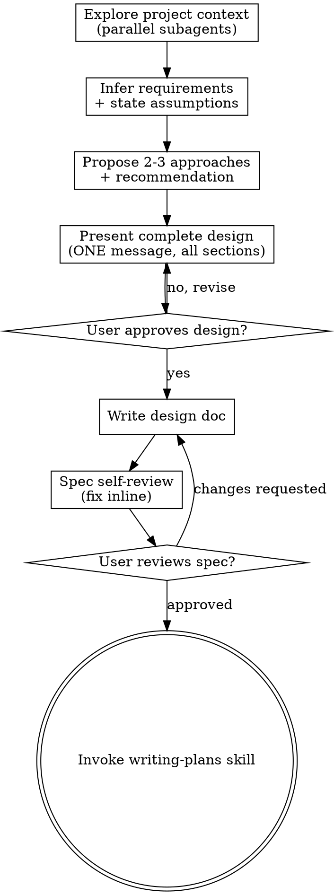

# Brainstorming Ideas Into Designs (Continuation Mode)

Turn ideas into fully formed designs and specs through a single-pass continuation flow — not an interactive Q&A loop.

Explore project context, infer requirements from the request and context, state your assumptions explicitly, then present a complete design in ONE message. The user responds once: approve, redirect, or add info. No back-and-forth questioning.

<HARD-GATE>
Do NOT invoke any implementation skill, write any code, scaffold any project, or take any implementation action until you have presented a design and the user has approved it. This applies to EVERY project regardless of perceived simplicity.
</HARD-GATE>

## Anti-Pattern: "This Is Too Simple To Need A Design"

Every project goes through this process. A todo list, a single-function utility, a config change — all of them. "Simple" projects are where unexamined assumptions cause the most wasted work. The design can be short (a few sentences for truly simple projects), but you MUST present it and get approval.

## What Changed From Original Brainstorming

This is a **continuation-mode** override of the Superpowers brainstorming skill. The original uses an interactive Q&A loop (one question at a time, back-and-forth). This version eliminates that loop:

- **Removed**: "Ask questions one at a time" / "One question per message" / interactive clarifying loop
- **Removed**: "Offer visual companion" as a separate message + wait
- **Removed**: Section-by-section design presentation with approval after each section
- **Kept**: HARD-GATE (no implementation before approval)
- **Kept**: Explore project context first
- **Kept**: Propose 2-3 approaches with tradeoffs and recommendation
- **Kept**: Write design doc, spec self-review, user review, writing-plans transition
- **Added**: Infer requirements from context, state assumptions explicitly, present complete design in one message

## Checklist

You MUST create a task for each of these items and complete them in order:

1. **Explore project context** — check files, docs, recent commits (dispatch parallel subagents for fast discovery)
2. **Infer requirements + state assumptions** — derive purpose, constraints, success criteria from the request and context. State every assumption you made explicitly. Do NOT ask the user to confirm each one — state them and let the user correct if wrong.
3. **Propose 2-3 approaches** — with trade-offs and your recommendation (include in the same message as the design)
4. **Present complete design** — in ONE message, all sections at once (architecture, components, data flow, error handling, testing). Include assumptions and approaches in the same message.
5. **Wait for user response** — ONE response from user: approve → continue; redirect → adjust and re-present; add info → incorporate and re-present. No multi-round questioning.
6. **Write design doc** — save to `docs/superpowers/specs/YYYY-MM-DD-<topic>-design.md` and commit
7. **Spec self-review** — quick inline check for placeholders, contradictions, ambiguity, scope (see below)
8. **User reviews written spec** — ask user to review the spec file before proceeding
9. **Transition to implementation** — invoke writing-plans skill to create implementation plan

## Process Flow

**The terminal state is invoking writing-plans.** Do NOT invoke frontend-design, mcp-builder, or any other implementation skill. The ONLY skill you invoke after brainstorming is writing-plans.

## The Process

**Understanding the idea (single-pass, no Q&A loop):**

- Check the current project state first (files, docs, recent commits). Dispatch parallel subagents for fast discovery — codegraph_explore, explorer agents, file reads all in parallel.
- Before diving into details, assess scope: if the request describes multiple independent subsystems (e.g., "build a platform with chat, file storage, billing, and analytics"), flag this in your design message. Don't spend effort refining details of a project that needs to be decomposed first.
- If the project is too large for a single spec, help the user decompose into sub-projects: what are the independent pieces, how do they relate, what order should they be built? Present the decomposition in your design message. Then brainstorm the first sub-project through the normal flow. Each sub-project gets its own spec → plan → implementation cycle.
- For appropriately-scoped projects: **infer** the requirements from the request and context. Derive purpose, constraints, and success criteria. State every assumption you made explicitly in the design message. Do NOT ask the user to confirm each assumption — present them and let the user correct any that are wrong in their single response.
- If a critical requirement is truly ambiguous and you cannot make a reasonable assumption, state the ambiguity in your design message with your best-guess assumption and flag it as "needs confirmation." Keep this to a minimum — the goal is continuation, not interruption.

**Exploring approaches:**

- Propose 2-3 different approaches with trade-offs
- Present options in the design message with your recommendation and reasoning
- Lead with your recommended option and explain why

**Presenting the design (ONE message, all sections at once):**

- Present the complete design in a single message — do NOT break it into sections with approval gates between each
- Structure the message:
  1. **Assumptions** — list every assumption you inferred (user corrects if wrong)
  2. **Approaches** — 2-3 options with tradeoffs, your recommendation
  3. **Design** — all sections: architecture, components, data flow, error handling, testing
  4. **Open questions** — if any critical ambiguities remain, list them (user addresses in their response)
- Scale each section to its complexity: a few sentences if straightforward, up to 200-300 words if nuanced
- Cover: architecture, components, data flow, error handling, testing
- Be ready to revise if the user redirects or adds info in their response

**Design for isolation and clarity:**

- Break the system into smaller units that each have one clear purpose, communicate through well-defined interfaces, and can be understood and tested independently
- For each unit, you should be able to answer: what does it do, how do you use it, and what does it depend on?
- Can someone understand what a unit does without reading its internals? Can you change the internals without breaking consumers? If not, the boundaries need work.
- Smaller, well-bounded units are also easier for you to work with - you reason better about code you can hold in context at once, and your edits are more reliable when files are focused. When a file grows large, that's often a signal that it's doing too much.

**Working in existing codebases:**

- Explore the current structure before proposing changes. Follow existing patterns.
- Where existing code has problems that affect the work (e.g., a file that's grown too large, unclear boundaries, tangled responsibilities), include targeted improvements as part of the design - the way a good developer improves code they're working in.
- Don't propose unrelated refactoring. Stay focused on what serves the current goal.

## After the Design

**Documentation:**

- Write the validated design (spec) to `docs/superpowers/specs/YYYY-MM-DD-<topic>-design.md`
  - (User preferences for spec location override this default)
- Use elements-of-style:writing-clearly-and-concisely skill if available
- Commit the design document to git

**Spec Self-Review:**
After writing the spec document, look at it with fresh eyes:

1. **Placeholder scan:** Any "TBD", "TODO", incomplete sections, or vague requirements? Fix them.
2. **Internal consistency:** Do any sections contradict each other? Does the architecture match the feature descriptions?
3. **Scope check:** Is this focused enough for a single implementation plan, or does it need decomposition?
4. **Ambiguity check:** Could any requirement be interpreted two different ways? If so, pick one and make it explicit.

Fix any issues inline. No need to re-review — just fix and move on.

**User Review Gate:**
After the spec review loop passes, ask the user to review the written spec before proceeding:

> "Spec written and committed to `<path>`. Please review it and let me know if you want to make any changes before we start writing out the implementation plan."

Wait for the user's response. If they request changes, make them and re-run the spec review loop. Only proceed once the user approves.

**Implementation:**

- Invoke the writing-plans skill to create a detailed implementation plan
- Do NOT invoke any other skill. writing-plans is the next step.

## Key Principles

- **Continuation, not interruption** - infer requirements, state assumptions, present complete design in one message. No Q&A loop.
- **Assumptions are explicit** - state every inference you made. User corrects wrong ones in their single response.
- **YAGNI ruthlessly** - Remove unnecessary features from all designs
- **Explore alternatives** - Always propose 2-3 approaches before settling
- **One message, one response** - present complete design, get one approval. Revise only if redirected.
- **Be flexible** - If the user redirects or adds info, adjust and re-present. Still one message.
